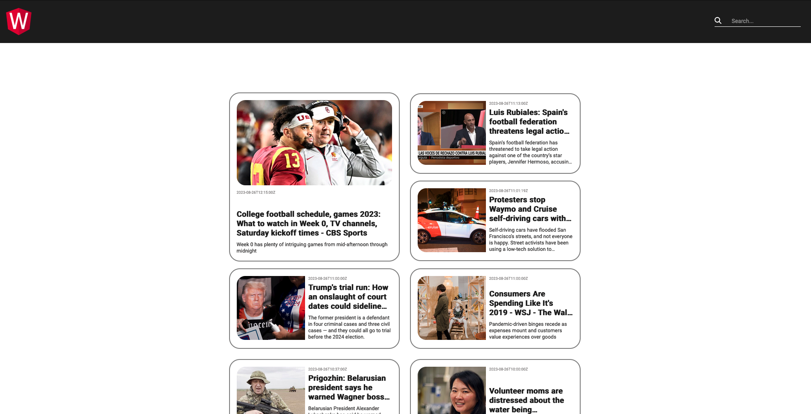
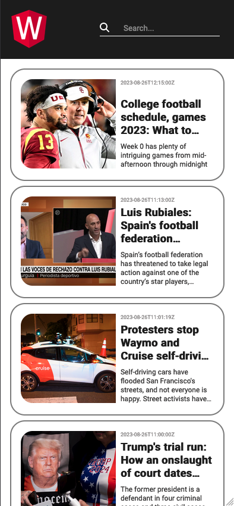

# AngularNewsBlog

This project was created to validate the knowledge acquired in one of the Bootcamp full stack modules (Angula + Java), promoted by Digital Innovation One.

  

    
  

  

    
  

## Running in local environment

Create `src/environmet.ts` file and add your api key to it.

Run `ng serve` 

